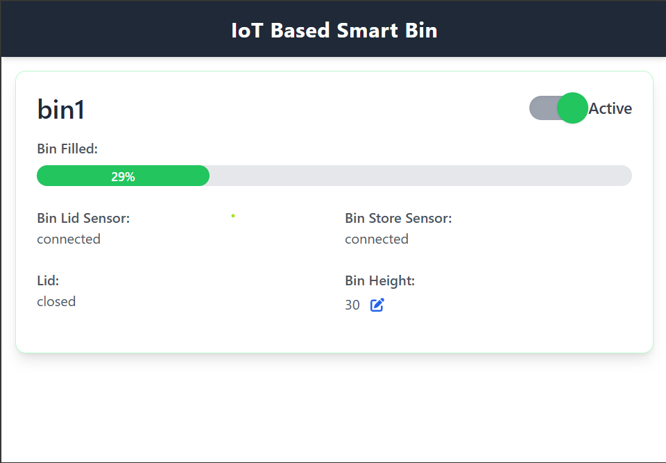

# IoT-Based Smart Bin

A smart waste management solution that combines hardware automation with real-time monitoring capabilities. The system features an automated lid, fill-level monitoring, and a web-based dashboard for remote management.



## 🎥 Demo Video
https://github.com/user-attachments/assets/99108cda-3056-4b40-88b4-1f4dc9fa7f96

## ✨ Features

- **Automated Lid Control**: Touchless operation using ultrasonic sensors
- **Real-time Monitoring**: Track fill levels and bin status
- **Web Dashboard**: Built with React + Vite for real-time visualization
- **Firebase Integration**: Real-time data synchronization
- **Component Status Tracking**: Monitor the health of sensors and servo
- **Configurable Settings**: Adjustable bin height and status controls

## 🛠️ Technology Stack

### Hardware
- Arduino (with WiFi capability)
- Ultrasonic Sensors (HC-SR04)
- Servo Motor
- Power Supply Unit

### Software
- **Frontend**: React + Vite
- **Backend**: Firebase Realtime Database
- **IoT**: Arduino IDE
- **Libraries**:
  - Firebase Arduino Library
  - ArduinoJson
  - Servo Library

## 📦 Installation

### Hardware Setup
1. Connect the components according to the following pin configuration:
   - Bin Lid Sensor: Trigger Pin 8, Echo Pin 12
   - Bin Store Sensor: Trigger Pin 4, Echo Pin 7
   - Servo Motor: Pin 9

### Software Setup

#### Arduino
1. Install required libraries through Arduino IDE:
   ```
   - Firebase Arduino Library
   - ArduinoJson
   - Servo
   ```
2. Create a `secrets.h` file with your credentials:
   ```cpp
   #define WIFI_SSID "your-wifi-ssid"
   #define WIFI_PASSWORD "your-wifi-password"
   #define REFERENCE_URL "your-firebase-url"
   ```
3. Upload the code to your Arduino board

#### Web Dashboard
1. Clone the repository
   ```bash
   git clone [your-repository-url]
   ```
2. Install dependencies
   ```bash
   cd smart-bin-dashboard
   npm install
   ```
3. Configure Firebase
   - Create a `.env` file with your Firebase configuration
   ```env
   VITE_FIREBASE_API_KEY=your-api-key
   VITE_FIREBASE_AUTH_DOMAIN=your-auth-domain
   VITE_FIREBASE_DATABASE_URL=your-database-url
   VITE_FIREBASE_PROJECT_ID=your-project-id
   ```
4. Start the development server
   ```bash
   npm run dev
   ```

## 🌟 Key Features Explained

### Automated Lid Operation
- Detects hand movement within 5cm range
- Opens lid automatically for 4 seconds
- Updates status in real-time on dashboard

### Fill Level Monitoring
- Continuous monitoring of waste level
- Percentage-based fill indication
- Alert system for when bin is nearly full (95% threshold)

### Component Health Monitoring
- Real-time status of sensors and servo
- Automatic failure detection
- Fault reporting through dashboard

## 📊 Dashboard Features

- Real-time fill level visualization
- Component status indicators
- Bin height configuration
- Active/Inactive status toggle
- Responsive design for all devices

## 🤝 Contributing

Feel free to fork this project and submit pull requests. For major changes, please open an issue first to discuss what you would like to change.

## 📝 License

[Your chosen license]

## 👥 Contact

[Your contact information]
